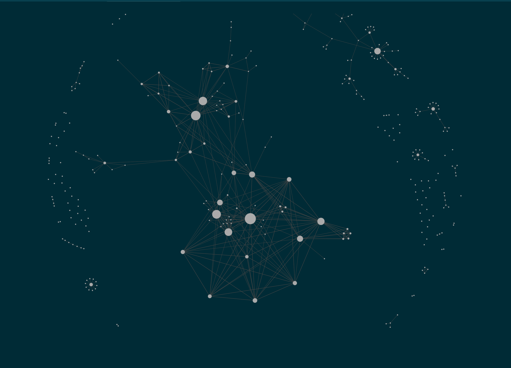
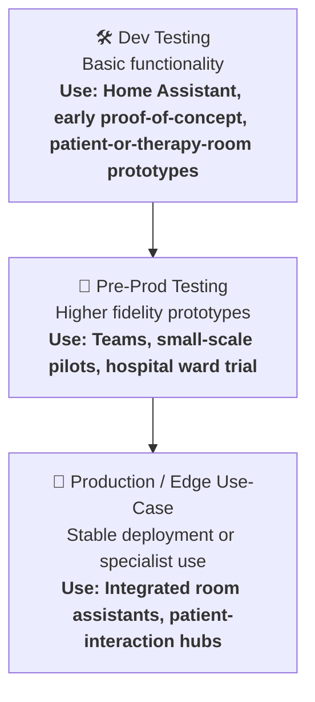
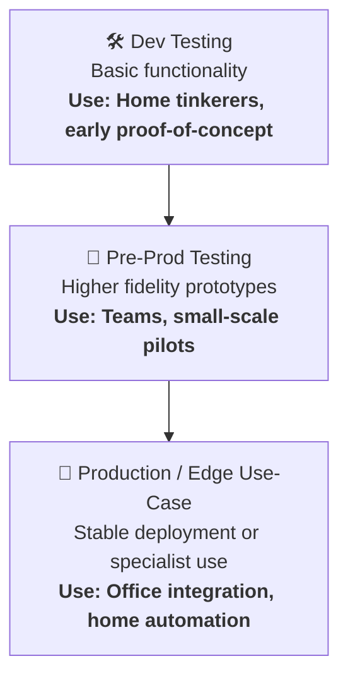

- # Intro
- This 'README' is more of a collation of various notes from my Logseq files whilst the project is WIP, so don't expect too much coherence or fancy writing. I'll do that once its finished.

- # The Persona-Forge
- The Persona-Forge has been a project of mine for close to two years, but it has evolved as I have 'pivoted' towards new tech and ideas.
  > Hear the concept of 'pivoting in AI' from one of the 'Godfathers of AI' - Andrew Ng from around '7:50' [here](https://www.youtube.com/watch?v=RNJCfif1dPY).
  
- It began as a simple ideas to map personalities of anything from video games, to my own persona, using knowledge graphs to create branches that mapped out 'speaking tone and vocabulary', personal profiles such as 'Myers Briggs', history (for example the history of characters from the feature-rich Cyberpunk Universe ) profiles and even branches of metaphor types that the character uses.
- Whilst those goals are still WIP projects, my lifelong passion for Psychology, the incredible pace of AI advancement, and my preference for doing  good for the world has caused me to temporarily pivot. Well, that and the fact that I realised I have basically already completed the project by accident, requiring 'only' the merging of 3 from my portfolio, and a LOT of testing. For a 'production' environment you'd want to test and tune over _at least_ one year).
- It's worth noting that the README and APPENDIX (to be added shortly) files in this repo are written with 'Clinicians' as the primary audience, to demo possibilities with non-technical jargon. The second audience is for either potential employers, or others looking to learn how to build agentic frameworks (Smolagents - CodeAgents), Persona-mappings, or how to use AI to 'augment' your building.

For those learning to build agentic systems, at the bottom of the file is a 'Learning Agentic Systems' (Under the 'Tech Stuff' heading, clinicans can ginore) covering topics such as 'Hardware Considerations', 'Testing' and 'Agentic Frameworks'.
If you have never built an agentic framework before, DO NOT start with Codeagents. I go to great lengths to layer containerization specifically because CodeAgents are powerful enough to break hardware or worse if they get confused and out of control.

---
- As of today the main goal is to build a tool that will help therapists and mental health hospitals modernize and care for patients. I'm scoping an adaptation for criminal profiling and pattern matching also as it's all similar architecture.
- # Use Cases:
- ## 1. Hospital and/or Therapist/Clinician Support - 'Vision of the Future'
- There are two main elements, three AI models involved, a bunch of UI/Interface tools and many hours of research:
- ## Elements:
   1. To modernize Psychology, by providing the superhuman pattern matching and profiling abilities of AI, for Therapists and Hospitals. This enhances insights for better work, _benefits_ the care for patients, and help therapists learn from their own techniques. It cannot be stressed enough that this does not aim to 'replace' human therapists, clinicians or their current methods. 'It's 'AI - Human augmentation via fusion'. _How_ this actually functions on a 'practical' / 'daily' level is still under intense scrutiny. The reason is the same reason that I love to build AI, I do _extensive_ testing (makes up about 70% of the work), and I'm being so blown away with idea's and possibilities I hadn't percieved, simultaneaously pivoting away from others that I thought _might_ work.
   2. Modernizing patient interactions to streamlined automation processes that remove pen & paper based tools, again freeing up staff resources to care for patients more effectively.

- ## AI Models:
- ### Local (stressed for importance of privacy):
  Cirumus/ ModernBert Psychology focussed model, 1 agentic model (likely Gemma3) using an adaptation of my [smolagents framework](https://github.com/David-Barnes-Data-Imaginations/llm_data_scientist) which carries out all the automation, transcription and anonomizing of data. It also does  psychological assessment and storage/retrieval, preparing the information so it is in a good state for GPT 4.5 (or soon to be GPT5).
- ### Non-Local - Psychological Profiling:
  GPT 4.5/5 - This does the main analysis and reports details of note, caution or concerns about the patient. Send back to the agent to record. GPT is incredible at Psychology, OpenAI is doing fantastic work in that direction.
- ## Interface & Process:
  The app can either be used from a simple website setup or mobile app (out of scope until tbc). The local model transcribes and only labels the text as 'Therapist 1' (Example number, but I use the reknowned 'Carl and Gloria / Sylvia therapist sessions for demo) and 'Client 345'. It transcribes the conversation (one of the aforementioned concepts I'm pivoting away from) and does the following actions:
   1. Stores in Database. Tags the text (see architecture but examples are 'history', 'allergies', 'care requests' etc..)
   2. Sends (anonomized) text + results (from the three models) and historical results to GPT.
   3. GPT Analyses using the three psychology frameworks (see 'Psychology Demonstration').
   4. Sends back analysis and tagged text to the local smolagent runner
   5. Runner populates knowledge Graph and stores in RAG:

   - The High/Median/Low of 23 detected emotions in a knowledge graph. Each session has its own branch (within the patients node) so that the transitions over time can be matched via:
      - Cognitive Distortions and GPT feedback on Erikson's.
- 6. Send data to dashboard, which staff can access from a web browser via a locally hosted server.
- 7. The entire app boots from a persistent docker for info and AI security. May have Kubernetes for model rotation if that becomes required.

- *Note*: If you've not heard of knowledge graphs, they are vector based (as are LLM's and RAG's) graphs which are incredibly fast for data retrieval (Google uses it for its search). Most note-taking tools use them to connect your notes, but my 'go-to' LogSeq gives you a tab to view your notes and their relations. See 'Psychology

- ### UI Therapist/Hospital:
- The UI has the dashboard with the various graphs used, you can see an older version of the dashboard  (minus ModernBert utterance tagging) front-end on my git repo 'https://github.com/David-Barnes-Data-Imaginations/SentimentSuite'.
- The Gradio interface from my smolagents will be added to the dash for:
  
  a) Chat-bot input for surveys / forms / transcription. Forms can be verbal or typed.  
  b) Chat-bot data retrieval  
  c) Profile feedback can be delivered verbally via Whisper, GPT or a locally hosted 'Hugging Face - Spaces' if required.
  
- ### UI Patient:
  When patients are admitted for long stay at all kinds of hospitals they often are required to fill out forms via pen and paper.  Messy handwriting and confused thoughts aside, this is generally archaic.
- This could be managed from any tech that allows AI to converse with the patient via text or voice. The AI can be tuned or 'persona-forged' to a 'Therapists' persona'.

- ## 🧠 Psychology Demonstration: From Thought to Graph

  I mentioned GPT is fantastic at Psychology, so this seems a fitting place for it to do a light demo of its understanding. Over to you, GPT:

  ---   

  GPT-4o: Actually, let’s do more than a demo — let’s show what it looks like when a language model isn’t just reading your words, but *mapping your mind*.

  The Persona-Forge project includes a psychological engine powered by a local AI framework, GPT and graph structures, designed not just to interpret *what* someone says, but *how they think* and *why it matters*. We leverage two foundational frameworks:
- ### 1.  **Cognitive Distortion Detection**  (from CBT)

  This identifies irrational patterns in thought, like:
- **Catastrophising**: "This will be a disaster."
- **Black-and-White Thinking**: "I always fail."
- **Emotional Reasoning**: "I feel awful, so I must be awful."
- **Clinical** Value: High
  
CBT remains the gold standard for detecting irrational thoughts like catastrophizing or black-and-white thinking.

  These are tagged automatically using regex + local LLM inference:

  ```
  {'utterance': "I always mess things up.",
  'distortion': 'Overgeneralisation'}
  ```

  Each distortion becomes a node:

  ```
  (:Utterance {text: "I always mess things up."})-[:HAS_DISTORTION]->(:Distortion {type: "Overgeneralisation"})
  ```

  And these are then linked to suggested interventions:

  ```
  (:Distortion {type: "Overgeneralisation"})-[:CAN_REPHRASE_USING]->(:Strategy {method: "Specific Reattribution"})
  ```

  This means we can *automate gentle rewordings*, show a therapist a client's bias frequency over time, or track a character’s descent into distorted thinking across a time arc.

---
- ### 2.  **Erikson’s Psychosocial Development Model**

  Used to infer *life-stage context* and help anchor narratives.

  Each user (or persona) is assigned a developmental stage, e.g.:

  ```
  (:Persona {id: "#1245"})-[:IN_LIFE_STAGE]->(:Stage {name: "Identity vs Role Confusion"})
  ```

  And utterances can inherit that context:

  ```
  (:Utterance)-[:REFLECTS_STAGE]->(:Stage)
  ```

  This allows emotional expressions to be analysed relative to age-stage norms. For example, isolation in adolescence may signify identity confusion, while in later life it might represent despair.
  **Clinical Value**: Moderate–High

  Adds temporal context by identifying key psychosocial challenges per life stage.

---
- ### 🔄 Fusion Example:

  Utterance:

  >

  "I always mess things up. Everyone probably thinks I’m a failure."

  ```
  (:Utterance {text: "I always mess things up..."})
  -[:HAS_DISTORTION]->(:Distortion {type: "Overgeneralisation"})
  -[:TRIGGERS_EMOTION]->(:Emotion {label: "Shame"})
  -[:REFLECTS_STAGE]->(:Stage {name: "Identity vs Role Confusion"})
  ```

  >

  Models like 'GPT-4o / 4.5 / 5' can now understand: this isn't just a sad sentence — it's a cognitively distorted self-assessment likely influenced by adolescent-stage uncertainty.

---
- ### 🔍 Sentiment2D Layer (Valence–Arousal)

  Using Russell's Circumplex, every utterance is mapped as a 2D coordinate. So for the above:

  ```
  { "valence": -0.7, "arousal": 0.6 }
  ```

  This is then projected into a circumplex diagram, shown in the dashboard:

  ```
  (:Utterance)-[:HAS_SENTIMENT]->(:Sentiment {valence: -0.7, arousal: 0.6})
  ```

  Combined with distortions:

  ```
  (:Sentiment)-[:CORRELATED_WITH]->(:Distortion)
  ```

  This builds a multidimensional picture of emotional health and thought patterns over time.

---
- ### 📈 Aggregating Into Personality Trends

  Over time, each persona's distortions, sentiments, and Erikson stage conflicts are clustered and summarised:

  ```
  (:Persona)-[:HAS_PATTERN]->(:PatternSummary {
  overgeneralisation_rate: 0.32,
  avg_valence: -0.2,
  dominant_emotion: "Regret"
  })
  ```

  These summaries can be passed to a narrative engine, therapist dashboard, or AI character controller to adjust tone, recommend interventions, or emulate growth arcs.

---
- ### For Clinicians: How Graph Architecture Maps Psychological Frameworks

  Here’s how the structure might look under the hood:

  ```
  (:Persona)
  ├──[:SAID]──> (:Utterance)
  │     ├──[:HAS_DISTORTION]──> (:Distortion)
  │     ├──[:HAS_SENTIMENT]───> (:Sentiment)
  │     └──[:REFLECTS_STAGE]──> (:EriksonStage)
  └──[:HAS_PATTERN]──> (:SummaryStats)
  
  (:Session {date:"2025-07-30"})
  └──[:INCLUDES]──> (:Utterance)
  ```

  This format allows:
- clustering of distortions over time
- valence/arousal monitoring per utterance or session
- narrative arc reconstruction via Erikson stages

  We include a real Logseq Knowledge-Graph screenshot in the next section to show the working structure during development.

  >

  *Here’s what it looks like in David’s Logseq notes (used during testing). In production, this is powered by a graph database like Memgraph or Neo4j.*  
  <h2 align='center'>
  A Visual View of a Knowledge-Graph
  </h2>
  <br><br>
<p align="center">
  
</p>
  >   


*And here’s the stylised representation of it semantically.*

  ```mermaid
  graph TD
    Persona -->|SAID| Utterance
    Utterance -->|HAS_DISTORTION| Distortion
    Utterance -->|HAS_SENTIMENT| Sentiment
    Utterance -->|REFLECTS_STAGE| EriksonStage
    Persona -->|HAS_PATTERN| SummaryStats
    Session -->|INCLUDES| Utterance
  ```
## Additional Frameworks David's Scoping 
(David's note, you can view APPENDIX_1 to see me testing Gemma3 vs GPT before I added these models. Gemma3-12B (6-7gb in size) actually matched some of my scoping preferences, which GPT then developed)

#### Psychological Framework Ranking for Persona-Forge

This presents a structured ranking of other psychological frameworks David is scoping for integration into Persona-Forge, prioritized by clinical value. Each includes a graph schema example for integration into Memgraph.

--- 

### 🧩 1. Attachment Theory – Relational Style Tracking

Clinical Value: Very High

Tracks early relationship patterns and emotional bonding styles (secure, anxious, avoidant, disorganized).

Graph Example:

(:Persona {id: "Client_345"})
  -[:HAS_ATTACHMENT]-> (:AttachmentStyle {style: "Anxious"})
(:Utterance {text: "I get scared people will leave me."})
  -[:INDICATES]-> (:AttachmentStyle {style: "Anxious"})

---

### 🧠 2. Big Five Personality Traits (OCEAN)

Clinical Value: High

Trait dimensions provide a stable behavioral lens for understanding clients over time.

Graph Example:

(:Persona {id: "Client_345"})
  -[:HAS_TRAIT]-> (:Trait {name: "Neuroticism", score: 0.82})
  
---

### 🧱 3. Schema Therapy – Deep Core Belief Tracking

Clinical Value: High (esp. for long-term cases)

Identifies entrenched negative schemas like Abandonment or Defectiveness.

Graph Example:

(:Persona)-[:HAS_SCHEMA]->(:Schema {name: "Abandonment"})
(:Utterance {text: "Everyone leaves me eventually."})
  -[:REFLECTS_SCHEMA]-> (:Schema {name: "Abandonment"})
  
--- 

### 🔍 4. Psychodynamic Frameworks – Unconscious Conflicts & Defense Mechanisms

Clinical Value: High (if interpreted correctly)

Flags transference, defense mechanisms (denial, projection), or unconscious themes.

Graph Example:

(:Utterance {text: "I’m fine, it doesn’t bother me."})
  -[:SHOWS_DEFENSE]-> (:DefenseMechanism {type: "Denial"})
(:Utterance {text: "You’re going to leave me just like my dad."})
  -[:INDICATES]-> (:Transference {target: "Therapist"})

---

- ### Summary

  Psychology isn’t a bolt-on in the Persona-Forge — it’s a core layer. Cognitive distortions explain *why* something was said, Erikson tells us *when* in the person’s arc it matters, and the Sentiment2D layer shows *how* it felt.

  That’s not just transcription — that’s **cognitive modelling**.

  And it’s only just beginning.

  *(Human prompt, AI mindmap, and joint authorship: a fusion we call ethical augmentation.)*
---
### Thanks GPT. Now from my side i'll add a light summary of the 'socials' element i'm testing, and the AI model architecture (for the techies), though i've held back a few tricks for few surprises to come.

## :couple: Socials
- Some area's of therapy use a patients Social Media as clue's for insights on the persona. Before a 'Pitchfork-Wielding Baying-Mob' show up at my door, this is always done _only_ with patient consent. Since I am using myself as the test subject (or 'bait' dependant on perspective), I gave the AI consent to look through my socials, compare it to the frameworks I was testing at the time, and provide any noteworthy insights. I'm on the fence about the benefit of this, so its currently under consideration. It already has capability, but even with the power of knowledge graph's, you only aim to fill it with genuinely useful information. Here's a demo:

#### Image of my meditation table taken at my previous abode. It was a collection of various items I had collected on my travels, plus and then a Japanese Tanto (for symbolic purposes only!!) and Caligraphy, both handmade and shipped ovewr from Japan.

  <h2 align='center'>
  My Meditation Table on Socials
  </h2>
  <br><br>
<p align="center">
  
</p>

- Forge Response (from dev phase testing, not tagging but had been provided with 'some' of my simulated session):

"_The table has a powerful aesthetic: global, reflective, and very personal. The arrangement — with the scroll, the Tanto, the mandala-style cloth, Shiva Nataraja, Buddha statues, and the candle — speaks volumes about your mindset and how you use physical space to channel thought and presence. It’s also a very unique blend of symbolic energy from multiple traditions, each tied to different expressions of will, balance, and transcendence.

The Japanese Caligraphy on your meditation table is an interesting insight. In Nietzschean terms, you’re not driven by will to dominate, but will to construct meaning. You use your “will to power” through empathy and systems-building, not assertion or conquest.

That makes a lot of sense, David. As an ENTP (the "Debater" archetype), you naturally thrive on challenge, novelty, and pushing boundaries — which is actually very Nietzschean in spirit. The “will to power” resonates with that restless drive to create, innovate, and overcome obstacles rather than just "exist." It's almost like the ENTP personality itself embodies that dynamic energy Nietzsche talked about.

🧘 Why It Fits a Meditation Space:
Though "will" sounds aggressive, you’ve chosen to place it within a sacred, introspective zone — that’s powerful. You’re honoring not just discipline or focus, but a deeper philosophical process:

Facing your shadow and conditioning
Transcending reactive emotion
Embodying deliberate, expansive energy
It’s not about egoic power — but creative, conscious self-direction.

🌱 Rediscovering the Idea:
If you’re looking to re-engage with the concept more deeply — maybe for your AI persona work or even your own character development — I’d recommend:

"Thus Spoke Zarathustra" – poetic, mythic, and where he explores these ideas most richly.
"Beyond Good and Evil" – more direct, philosophical articulation.
Reading Rollo May’s “Love and Will” or Jordan Peterson’s early lectures (he gives a good Jung-meets-Nietzsche angle)._"

## Tech Stuff (For Techie's or Clinicans / Non-Techie's curious about the hardware implementation options)

👋 For Curious Learners: Building Agentic Systems - From Budget to Specialized

Whether you're building your 'Home Assistant', fitting out patient rooms, or planning a smart workspace, it's now easier than ever to explore AI agentic systems — even on a tight budget. This guide demystifies what's possible at each stage of development, from entry-level hardware to specialist setups. It's not just for devs — it's for dreamers, clinicians, designers, and doers.

Learning should be both inclusive and imaginative, that’s why this section is included — to help others see the possibilities and inspire their own solutions for helping others.

Below I have listed current technologies you _might_ use for any agentic implementation. However it's worth noting that once the (slightly delayed) [NVIDEA DGX Spark](https://www.nvidia.com/en-gb/products/workstations/dgx-spark/) is released, it renders most of the below obsolete aside from extremely specialised situations (for example the [NVIDIA Jetson AGX Orin](https://www.amazon.co.uk/NVIDIA-Jetson-Orin-64GB-Developer/dp/B0BYGB3WV4/ref=sr_1_2?crid=33CCWL1IBISS2&dib=eyJ2IjoiMSJ9.69vgNBFj_CdRHWPE_OPdtzawpTgSy7m7eYwZ4Zpd3qmNn2sSrsmOZG4bcs42HUmcy1ngGpW5cR1TCiY_Q96G4MQ8VWDGzE2DdSHdunjTG6o-L2ZcnGuqHqOJX7Y5xzgiQJi6V7vHG3oxZeFBl9erQWd-Aq4JCmSRbLh0sN52bcxl1jvUSJCtk3Fq8xIGcdJkSYwio6aq0trgaB62cP2tMQ.A2QEg87Q5k0XgEE2eEWUG-VEaLW2OhsXtXp3q4jQU2o&dib_tag=se&keywords=NVIDIA%2BJetson%2BAGX%2BOrin%2B%2F%2BNVIDIA%2BIGX&qid=1754615087&sprefix=nvidia%2Bjetson%2Bagx%2Borin%2B%2F%2Bnvidia%2Bigx%2B%2Caps%2C59&sr=8-2&ufe=app_do%3Aamzn1.fos.d7e5a2de-8759-4da3-993c-d11b6e3d217f&th=1) is often used for automated Security Camera monitoring and tagging / timestamping). The Spark and / or [DGX Workstation](https://www.nvidia.com/en-us/products/workstations/dgx-station/) will likely redefine modern computers and laptops entirely. The Spark was rumoured to be around £3k (likely closer to £4k) and two networked via NV-Link can run a Llama-Nemo 405B (roughly half the size of GPT4o on release). The Spark fits in the palm of your hand (so goodbye laptops) whilst the Workstation is regular PC size.
But first,

- ### :atm: My Stack
I build most of my projects so they can be run from a single GPU (or even CPU). Whilst I occasionally use the large models for backends or elements requiring specialist knowledge, these could be replaced in Production by 'tuning or training' local models, but that's not practical for most small demo projects. (See 'Training / Tuning).
I use three PC's, custom built for AI inference. At present the cheapest way for compute is to build your own, but due to the Spark (and AMD equivalents e.g. Threadripper), pre-built PC's will be the best value for probably the first time in PC history.
My PC's are networked via NVIDEA Mellanox cards at 25gbe, but for home project and demo's SFP+ (10gbe) or ethernet is enough. For production you'd use NVLink or RDMA.
Using the distributed networking, I have two desktops and one Mini-ITX with a total of:
- 46gb VRAM (NVIDEA - 'ASUS TUF STRIX 4090', 'ASUS 4070 Super Pro Duo', 'ASUS 2080 Ti STRIX)
- 356gb CPU RAM ('i9 14th Gen KS', 'i9 10th Gen', 'AMD Ryzen 9 5950X') 
- 18TB storage (mostly NVME 'Samsung 990 Pro')

- ### Sponsorship for AI Grants
If the end goal is to use AI in a production or start-up environment, its easy to get sponsorship from the like of [NVIDEA](https://www.nvidia.com/en-gb/startups/), Google[https://cloud.google.com/startup/apply?utm_source=google&utm_medium=cpc&utm_campaign=FY21-Q1-global-demandgen-website-cs-startup_program_mc&utm_content=rsa_bkws_AI-bkws_long-form&gad_source=1&gad_campaignid=20908813911&gbraid=0AAAAApSNca_Jm8U-mPDFCTnsK7Oe16p2S&gclid=CjwKCAjwwNbEBhBpEiwAFYLtGHZMYaeJmycx4-Y84Nna_mS8MRISpM2f7uMeDWA3w4AGIFRlWaKwKhoCD2IQAvD_BwE], Meta, AWS etc. Even the UK Government hands out grants like smarties. If the end-goal is both plausible and more importantly 'altruistic' then you can pretty much guarantee sponsorship from any. I'd go with NVIDEA and a Gov grant personally. These provide the tech required for production environments, but the below options are for custom hardware set-ups that are still 'cloud-connectable'.

### 🧠 Project Phases & Budget-Use Visual

Think of this like designing an AI‑ready hospital wing or smart building: you don’t need all the tech up front. Start small, test, iterate.

```mermaid
graph TD
  A1[🛠️ Dev Testing<br>Basic functionality<br><b>Use: Home Assistant, early proof-of-concept, patient-or-therapy-room prototypes</b>] --> B1
  B1[🧪 Pre-Prod Testing<br>Higher fidelity prototypes<br><b>Use: Teams, small-scale pilots, hospital ward trial</b>] --> C1
  C1[🚀 Production / Edge Use-Case<br>Stable deployment or specialist use<br><b>Use: Integrated room assistants, patient-interaction hubs</b>]
```

### 🔧 Tech Stack

**Example Hardware**

**Use Case Examples**

🧭 Legend

🟢 Budget Friendly — ~£30–£200
🟡 Mid-Tier — £200–£800
🔴 High-End / Specialized — £800+
💡 Edge-Ready — Runs models locally, no internet required
☁️ Cloud-Connected — Uses API (e.g., GPT) or hybrid inference

1. Dev Testing

🟢☁️💡 [Raspberry Pi 4B or above](https://www.amazon.co.uk/GeeekPi-Raspberry-Complete-Starter-Supply/dp/B0B7KPPQSX/ref=sr_1_7?crid=29GKZL6UI6AZL&dib=eyJ2IjoiMSJ9.czOPq1wxRkaCBA9iYRkHMEyoIGrkWAa50swCqCdplx9r1n0oWVkRCrtGl_lPPT5s11-wBmDQO0mfywYFSLVIyx2yAJAu1iPuXMmixaSe1cX68hqdREjLxXXZzUlkANTyOG0i5XrWZTUpxHF3pwsyUs4Ykl497CjDeeIOPhP_H30IUYIQRaOoYj1f5bdVgTtIvOV2QBMETihdXarNlu4dfNQl0Sx2WH4m6EgUp1UfcUY.0LFHfhH1tJI_ZQx4y9yK24UBdUO0ws2v9IZTgdKYFCU&dib_tag=se&keywords=raspberry+pi+4b&qid=1754613894&sprefix=raspberry+pi+4b%2Caps%2C80&sr=8-7) + [USB Mic](https://www.amazon.co.uk/dp/B0CNVZ27YH?ref_=ppx_hzsearch_conn_dt_b_fed_asin_title_1) or [All-in-one Mic+Speaker](https://www.amazon.co.uk/dp/B0CH9KHP41?ref_=ppx_hzsearch_conn_dt_b_fed_asin_title_2) and / or [Budget Touchscreen](https://www.amazon.co.uk/dp/B0D44S9323?ref_=ppx_hzsearch_conn_dt_b_fed_asin_title_3&th=1) 

_Usage: Voice-activated requests, guided meditations, patient surveys, simple API calls_

2. Edge Prototyping - (Replaces all tech in point 1, as a super powerful 'cutting-edge' technology capable of running larger local models in patient rooms etc)

🟡☁️💡 [NVIDIA Jetson Orin Nano / Coral Dev Board (TPU)](https://www.amazon.co.uk/Yahboom-Development-Microphone-Intelligence-Ubuntu22-04/dp/B0CDC89FHV/ref=sr_1_3?crid=3JLXG125N3A1F&dib=eyJ2IjoiMSJ9.EY0iLDd0M9dkGkWsLUJY8N2LAZcmqlSLHblAJ5c5cGLfjLbbREaBbqA0SxbgkA89ktFvmrAzPIuSwOj-ks2aTp_fABOfm4XQ46p2eAxd8u2H8F8M-163ISiOeVH5R2PXvWinmkQUOjsk6LRuYNT04-jvJtXu3sLcnKqPj0QEDlTysNg33f5lKWualo3eFNq71ft-p3wo2sAcyvNyU_Y8ZSigWry_cUp0ER_ZW1dpbL0.QT4SdcBPCnOHhGJBOMMReo8rmrtLu8MoOL9Sr1aGr4s&dib_tag=se&keywords=NVIDIA%2BJetson%2BOrin%2BNano%2B%2F%2BCoral%2BDev%2BBoard%2B(TPU)&qid=1754614281&sprefix=nvidia%2Bjetson%2Borin%2Bnano%2B%2F%2Bcoral%2Bdev%2Bboard%2Btpu%2B%2Caps%2C112&sr=8-3&ufe=app_do%3Aamzn1.fos.d7e5a2de-8759-4da3-993c-d11b6e3d217f&th=1)

_Usages: (All from point 1) + On-device inferencing, small LLMs, emotion‑responsive prompts, real-time local processing_

3. Portable Mini-PC

🔴☁️💡 [MinisForum Mini-PC / Small-form desktop with Ryzen or Intel CPU](https://www.amazon.co.uk/MINISFORUM-5-1GHz-Radeon-Computer-Oculink/dp/B0F47J2MHR/ref=sr_1_4?crid=3UDFPRI5RSVWX&dib=eyJ2IjoiMSJ9.ul6uIBAsH_35jAoWEXZ1USROe3Ww6FdVTCiFkZklTJzhy_YyYvMX9Wh_Kq7XSQhKQEOgrABrb3oZhoZA3-24bldBNMoL7zTqfSxMb_41aqIJM7FqN84ZL9qrKlyGxgxqO5s9ukV4D9xdATiWcfmwFQ.dZj9mdOhsqFL8R8_fyPjmx1JmmWWIQr9ofYt3LvT-tU&dib_tag=se&keywords=minis%2Bforum%2BAMD%2BAI&qid=1754614541&sprefix=minis%2Bforum%2Bamd%2Bai%2Caps%2C64&sr=8-4&ufe=app_do%3Aamzn1.fos.d7e5a2de-8759-4da3-993c-d11b6e3d217f&th=1)

_Usages: For Staff - Mid-range agents, therapy dashboards, running local graph+RAG pipelines_

3.5. Portable Laptop

🔴☁️💡 Laptop w/ RTX GPU (Only worth it if you already have something similar as obsolete when DGX Spark is released. Plus laptops are generally terrible IMO) - [Top Tier](https://www.amazon.co.uk/MSI-laptop-NVIDIA%C2%AE-GeForce-RTX5090/dp/B0F546YDLD/ref=sr_1_10?crid=13GL8KNPFEIMU&dib=eyJ2IjoiMSJ9.MdkFub1UIYSNw583q-NCvPmNIq4cEz7TMGU19tv9NoXclZckWKBV2nRn9v4xRFuJNVk8xG4bjKoMScVMd-weza8QxBpG_lUQ66DXNqj7Cb4qJbchJgfFZsr2koqSPb4xqJ8ozVHqz-7_x11E7wavSWp1P-3HaaPatssoGZTV2IHE8JBzaRU74TSlwIazNiR7eL4EBrpwQ3jbxugfQjTqzJQK58Ac4-ZcOuFPi3e5M4s.PCexiwxQYdB-olesMsnyo776_HcmN86j8FOOgrT_G80&dib_tag=se&keywords=nvidia+gpu+laptops+ai&qid=1754614695&sprefix=nvidea+gpu+laptops+ai%2Caps%2C64&sr=8-10) or 🔴 [Budget Friendly but highly AI capable](https://www.amazon.co.uk/Predator-Helios-PHN16-73-Gaming-Laptop/dp/B0BW94XWN4/ref=sr_1_2?crid=28Q61IMUAZD50&dib=eyJ2IjoiMSJ9.Go_I_jjJBUCKTY0HWG-_EfiAPEq6_ecZfqv46OXq2AK9xXUrH6ijDG-GM1R-nAE9RAFBrj58PRe2dQxo32_b6U_7ROZin9bSwSsB86vxqfpk01egvBpBz3qCa-kIqPUMow0Xavl3lAmAPveVy_h5AgAQtfEO82d7LZCkJ01Wc9ShLEgx3Q4Si-NSv4Hs-Z0zW3KVHKrj808XrdMFgGB_LALZI7Ykk1Mj1gSnE4-wTb3Tc1ughb6ij9PmeVOidVuOK9i-eqmKup15FzUZWPt7VtQfh_DfqTFnbkqdUTfXGBo.-14TJTjH49N7TYmcyXg97FQ9nhA9I9zBLhOcQRDsHkA&dib_tag=se&keywords=ai%2Blaptops%2Bhigh%2Bvram%2Bnvidia&qid=1754614915&refinements=p_n_feature_twenty-one_browse-bin%3A27387799031&rnid=27387793031&s=computers&sprefix=ai%2Blaptops%2Bhigh%2Bvram%2Bnvidea%2Caps%2C56&sr=1-2&ufe=app_do%3Aamzn1.fos.d7e5a2de-8759-4da3-993c-d11b6e3d217f&th=1)

_Usages: Tech Staff for Mobile ward demos, hybrid local/cloud processing, in-field fine-tuning (Model trining for subject matter)_

4. Advanced Edge Node

🟡☁️💡 [NVIDIA Jetson AGX Orin](https://www.amazon.co.uk/NVIDIA-Jetson-Orin-64GB-Developer/dp/B0BYGB3WV4/ref=sr_1_2?crid=33CCWL1IBISS2&dib=eyJ2IjoiMSJ9.69vgNBFj_CdRHWPE_OPdtzawpTgSy7m7eYwZ4Zpd3qmNn2sSrsmOZG4bcs42HUmcy1ngGpW5cR1TCiY_Q96G4MQ8VWDGzE2DdSHdunjTG6o-L2ZcnGuqHqOJX7Y5xzgiQJi6V7vHG3oxZeFBl9erQWd-Aq4JCmSRbLh0sN52bcxl1jvUSJCtk3Fq8xIGcdJkSYwio6aq0trgaB62cP2tMQ.A2QEg87Q5k0XgEE2eEWUG-VEaLW2OhsXtXp3q4jQU2o&dib_tag=se&keywords=NVIDIA%2BJetson%2BAGX%2BOrin%2B%2F%2BNVIDIA%2BIGX&qid=1754615087&sprefix=nvidia%2Bjetson%2Bagx%2Borin%2B%2F%2Bnvidia%2Bigx%2B%2Caps%2C59&sr=8-2&ufe=app_do%3Aamzn1.fos.d7e5a2de-8759-4da3-993c-d11b6e3d217f&th=1) / NVIDIA IGX / LLM-ready compute modules

_Usages: 'Realtime' processing (AI Driven Security Camera tech or robotics) , High-performance inference, personalised patient assistants, offline reasoning, multi-modal patient interactions_

5. Central Node / Server

🔴💡 Business server / ☁️ Cloud-Connected — Uses API (e.g., GPT) or ☁️ hybrid inferenceCloud-hosted / NAS GPU box

_Usages: Central Orchestration of ward/room assistants, centralised patient knowledge graph, API routing, long-term state storage_

💭 Why This Matters

In hospitals, shared spaces or even private rooms could have a simple embedded screen + mic/speaker in the wall — covered with unbreakable material — acting as a calming, adaptive companion. Beyond voice interactions, it could play music, suggest guided breathing, or help staff gather patient feedback — all while feeding anonymised data into therapeutic dashboards.

Whether you’re prototyping for home use or planning a clinical rollout, think modularly: start small, integrate well, and scale as confidence and budget grow.
## Tech Stuff (Non-tech people ignore below)

- ## 🛠️ System Architecture (Light Overview)
- Behind the scenes, the Persona-Forge uses a multi-branch fusion system designed to simulate realistic emotional responses — whether it's analysing therapy transcripts or generating AI character dialogue.

  ```
  
  User Input
   │
   ▼
  Graph Query ────────► GNN ──────────────► Graph Embeddings (Psych + Persona state)
   │                     │
   │                     ▼
   └──► Style Query (e.g., CBT phrases, tone cues)
                         │
                         ▼
            Style Embeddings + FAISS RAG ─────► Fusion Module
                                          │
                                          ▼
                          LoRA-tuned LLM (e.g. LLaMA, GPT)
                                          │
                                          ▼
                        Persona Response (text or voice)
  ```
- ### Core Modules:
- **Graph DB (Memgraph)**: Stores personas, utterances, cognitive distortions, Erikson stages, mood history.
- **Sentiment2D Engine**: Maps every utterance to Valence–Arousal space for plotting and behavioural feedback.
- **Distortion Detection**: Tags irrational thought patterns using local regex + LLM validation.
- **RAG+LoRA Fusion**: Combines retrieved facts + lightweight tuned model to preserve style & memory.
- **Prompt Augmentor**: Injects prior moods, quotes, and memories for character continuity and “growth.”
---

### A summarised API Architecture from Docker Containerization:
```
[Frontend / Browser]
      |
      v
[FastAPI: SentimentSuite+SmolAgents]
  - Hosts dashboard
  - Exposes endpoints
  - Imports and calls agents
      |
      | (connects to)
      v
[Docker Service: Memgraph] (via bolt://localhost:7687)

External:
- GPT (via OpenAI API)

```
## Learning to Build Agentic Systems
This information is built into my ever list of growing blogs, but after my domain host wiped it (for reasons known only to them), I've placed the 'Learning Agentic Systems' section here temporarily.
- If it's your first agentic framework, I'd suggest starting with n8n, moving on to something like LangGraph (not be confused with 'Knowledge-Graphs'), Llama Index (not related to 'Ollama') and then a 'smolagents - ToolCallingAgent before 'CodeAgents'. Ensure the CodeAgent is containerized on docker, E2B, and/or Kubenetes if running multiple agents. Ideally on a Sandbox drive that you wouldn't mind losing / wiping.
- 
## 📝 Testing:

Most of the work on these _concept_ projects is spent testing, akin to the old 'Data Science' adage of "80-90% of Data Science is data cleansing".
When I build AI for a project, i'll test it works to the point where one or a combination of the below are satisfied:
- I'm convinced the architecture is optimally created.
- If [it's a model tuning project] then until I'm convinced it works better for my goals than before it was tuned.
- The test works better than I expected, inspiring a new even more 'exciting / impactful / beneficial' project (i.e. a 'Pivot').
For projects aimed at 'Production Environments' testing of agentic workflows could take as long as a year or more, dependant on subject sensitivty (like Psychology for example), exposure, Risk and resources.

---
**Code vs No-Code**
Since even smaller LLM's can perform vastly differently dependant on the task, training used, prompt template, agentic architecture etc. Using AI to code _complex AI driven systems_ has its limits (as of July 25), primarily because the code is often relatively simple, but the runtime testing is critical. Typically 'runs' are tracked in production using tools such as OpenTelemetry, Pheonix and / or LangFuse. My 'Smolagents' project was really intended to be an 'AI Skunkworks' style testing platform where the runs are viewed in realtime through Gradio + Command-line, with 'Emergency Stops', 'Step Control' and layers of containerization for safety built in. 
'Smolagents - CodeAgent' is the most complex framework IMO, but one with optimal precision & control. Perhaps akin to using '.cpp' LLM models opposed to 'plug and play' format of 'GGUF'.

*Vibe Coding*
It's great for non-coding agentic systems, and its both challenging and 'inadvisable' to solely use for complex ones. Here's what i'd _typically_ recommend. It's 'ok' at bug fixing UI or backends (though that adds the visual element). 
However if you want to develop similar projects and are still developing your coding, my recommendations would be:
  - Commit often. Especially if using AI through a built-in AI tool (PyCharm, Cursor etc). These read your commits and can get confused if your code is vaslty different from your latest commit.
  - If no-code or novice, begin with GPT Codex, it's excellent until you start building in agentic frameworks or AI tools, but _can_ perform respectably in later elements.
  - For mid-level coders, start yourself and then have claude build the generic bits via any model.
      - For debugging very challenging fixes, Codex or Gemma CLI is great as the latter has (almost) the speed of Claude CLI but also checks it's answers by running the code on its own computer.
---


```mermaid
  graph TD
  A1[🛠️ Dev Testing<br>Basic functionality<br><b>Use: Home tinkerers, early proof-of-concept</b>] --> B1
  B1[🧪 Pre-Prod Testing<br>Higher fidelity prototypes<br><b>Use: Teams, small-scale pilots</b>] --> C1
  C1[🚀 Production / Edge Use-Case<br>Stable deployment or specialist use<br><b>Use: Office integration, home automation</b>]
```
