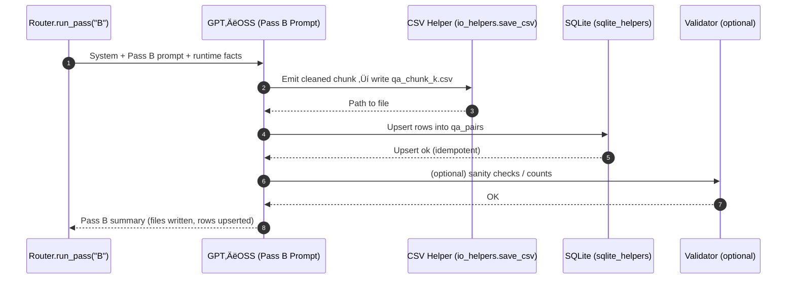
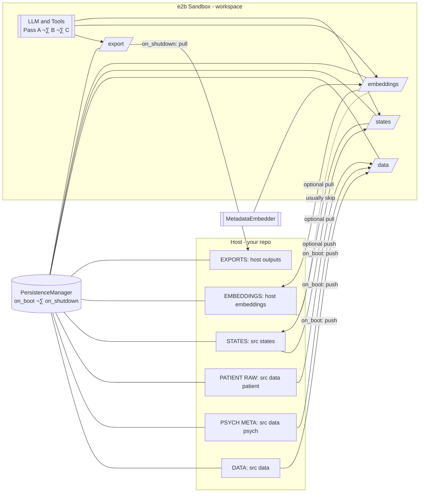
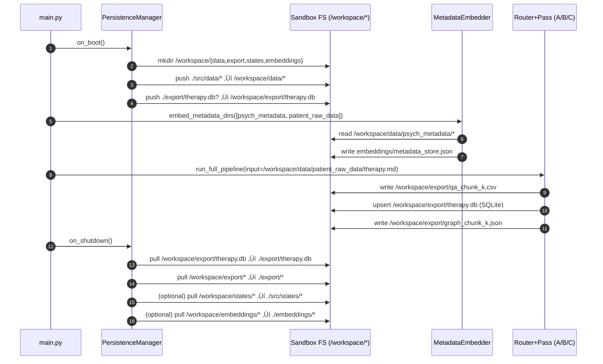
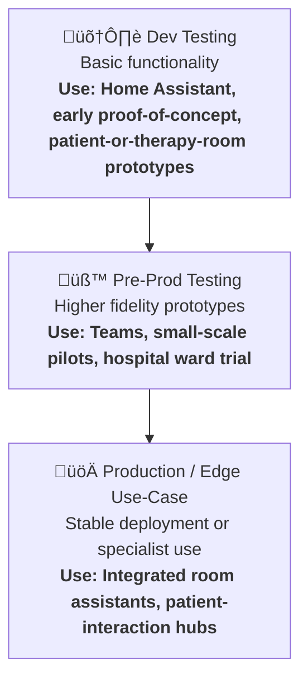

# Intro

---
### This 'README' is more of a collation of various notes from my Logseq files that I write during breaks from testing, whilst the project is WIP. Therefore don't expect too much coherence or fancy writing, i'll do that once its finished.

- If you're really bored you can also read my first blog (whilst my website is WIP) [here](https://github.com/David-Barnes-Data-Imaginations/blog.github.io/blob/main/_posts/2025-08-10-titles.md).
- You can also see the project structure [here](https://github.com/David-Barnes-Data-Imaginations/Persona-Forge-Psychology/blob/e2b_revert/directory_structure.md)
---
**For Clinicians / Non-Techies**:
- I present the core 'Psychology principles' involved first, to spare the pain of technical jargon. I cover _some_ technical aspects related to 'Knowledge Graphs', but graph syntax is closer to 'Structured English' than it is to a 'Coding Language'.
- The concept was developed from a [project](https://github.com/David-Barnes-Data-Imaginations/SentimentSuite) that was intended to be a 'light demo' for a friend, using 'Russells Cicumplex' and 'utterances' to evaluate therapy session transcripts (Carl & Gloria etc.)
---
**For 'Techies' or those learning to build 'Advanced Agentic Systems'**: 
- The code from my 'Agent Runner' 🏃 [smolagents 'Test & Trace' Dev-Environment](https://github.com/David-Barnes-Data-Imaginations/llm_data_scientist) is currently placed in this repo, with the [SentimentSuite](https://github.com/David-Barnes-Data-Imaginations/SentimentSuite) added in.
- The 'Agent Runner'🏃 can be tailoured to practically any task, using adaptations to the 'Prompt Templates and 'Tools', leveraging core 'Hugging Face - Spaces', MCP (I removed as it was out of scope), custom trained LLM or a 'Founder Model' backend. 
- At the very bottom is the 'Safety & Ethics' section, outlining how to run experiments with the incredibly powerful 'Smolagents' library, in a safe dev environment. This also contains advice on _how to learn_ 'SmolAgents' most powerful 'CodeAgent' functionality.
- Whilst this project has a specific goal / subject, the architecture has intentionally been built to be flexible enough so that it can be easily transferrable to other domains. These might include: Housing, Information Security or general business / government organizations.

### **_Why_ agentic frameworks?**
 
- Now if you're still getting to grip with the concept of agentic frameworks, who better to summarise than a former 'Google CEO' and 'Whitehouse Advisor' to multiple US Presidents: [Eric Schmidt](https://en.wikipedia.org/wiki/Eric_Schmidt).
- Bear in mind this was recorded a month ago, and a hell of a lot has happened in that month.
- The key segment is at [10:57] in this [video](https://www.youtube.com/watch?v=qaPHK1fJL5s). The process he describes in perfectly feasible, even 'easy' once you have a smolagents runner like mine.

### Here's a trimmed snippet if you want the tldr:

---
**_"The remarkable thing... and this is to me is shocking... is you can in 'an enterprise', write the task that you want and then connect your databases with an LLM which can produce the code for your enterprise.
If you built a brand new enterprise architecture, you would be highly tempted use open-source libraries, and essentially build that architecture, giving you infinite flexibility and the computer system and writes most of the code."_**

_Eric Schmidt_ July 2025

---

- ### TODO Note: After spending nearly 5 days trying to get gpt-oss to run across unified memory on Ollama, building servers for Triton, vLLM, Llama.cpp, and even a Custom Hugging Face API docker, Ollama is finally fixed on ubuntu.

# New _Updated_ (GPT-Powered) TODO and Ticklist
Since i've found myself stuck in one of the inevitable _quagmire's_ this type of project brings, having my code actually go backwards in the last week, I've a new plan written in tandem with GPT:
🛠️ Immediate Goals (Next 1–2 Weeks)

## Stabilize Agentic Framework
‚úÖ = Complete
‚úÖüéá = Implemented but significant testing throughout Dev-Phase Required
üì≤ = Currently in Progress
üîú = Still TODO
### üìë Use e2b sandbox instead of Docker 
- ‚úÖüéá Keep main.py, agent.py, chat.py, and metadata_embedder.py as core loop. ‚úÖ
- ‚úÖ Refactor Prompt Templates for GPT-OSS ‚úÖ
- ‚úÖüéá Current prompts (prompts.py) tuned for cleaning Therapy datasets. ‚úÖ

### Create a new dataset for therapy transcripts:
- ✅🎇 Agentic Pass 1 – Cleaning: Format QA pairs consistently. ✅
- ✅🎇 Pass 2 – Filing: Save each QA into: ✅

**Storage Methods**
- ‚úÖ Patient Directory (CSV) ‚úÖ
- ‚úÖüéá LiteSQL DB ‚úÖ
- ‚úÖüéá Graph-tagged JSON blocks ‚úÖ
- üîú Review in [Hugging Face - AI Sheets](https://github.com/huggingface/aisheets?tab=readme-ov-file) for human UI. üîú

**Pass 3 – Graph Build: Auto-generate Cypher queries to Memgraph.**
- ‚úÖüéá Therapy-Simulator Dataset Prep ‚úÖ
- ‚úÖüéá Run an agentic pass over therapy.md file. ‚úÖ

**Output 3 aligned formats**:

- ‚úÖ CSV directory (per session) ‚úÖ
- ‚úÖüéá SQLite DB (for structured queries) ‚úÖ
- ‚úÖüéá Graph JSON / Cypher file (for Memgraph load) ‚úÖ
- 
### 🧠 Agent Roles (Minimum Viable Setup)

**Agent 1 – Data Cleaner & Filer**
- ‚úÖ Basic Input Types: raw transcripts or QA pairs ‚úÖ
- ‚úÖüéá Output: CSV + SQLite + JSON graph blocks ‚úÖ

**Agent 2 – Graph Builder**

- ‚úÖüéá Workflow Input Types: JSON graph blocks ‚úÖüéá
- üì≤ Output: Cypher queries ‚Üí Memgraph üì≤

**Agent 3 – Patient Helper**

- üîú Handles patient room requests (forms, queries, meditations) üîú
- üîú Handle multiple inference inputs: e.g. via voice or text üîú

📹 **Agent 4 – VLM Monitor**

- üîú For Jetson + DINOv3 patient safety monitoring (Waiting for Jetson to arrive) üîú

### üìê Short-Term Workflow

**Router, Sandbox & LLM Testing.**
- Testing & Configuring the below implementations (roughly 2 days)
  - Pass 1 – Cleaning: Transcript → uniform QA pairs.
  - Pass 2 – Filing: Auto-save into CSV + SQLite + Graph JSON.
  - Pass 3 – Graph Build: Loop through JSON → Cypher → Memgraph.

_Checkpoint: Export graphs and show visualizations in SentimentSuite._
- _Gradio Blocks & Memgraph Tab added to SentimentSuite._

### üìä Technologies to Leverage

- [Hugging Face AI Sheets](https://github.com/huggingface/aisheets?tab=readme-ov-file) ‚Üí optional CSV formatting / QA review.
- Graph R1 ‚Üí advanced graph ops once base-graph is solid.
- Meta DINOv3 VLM ‚Üí Assess task suitability of model.
- **_Leverage all AI and new AI tools to return to previous pace of development_**

### New Persistent Storage Mechanism
- See GPT's second section: 
  - 'Agentic Loop' to 'Router' adjustment
  - 'Sandbox' / 'Storage Manager' adjustment

### Mid-Term Workflow (next 1-2 weeks)
- Split README into 2 parts:
- Set up 'Home Assistant' using re-engineered 'Alexa' hardware along with a [NVIDEA Jetson Nano - Camera Devkit](https://www.amazon.co.uk/Yahboom-Jetson-Development-Artificial-Intelligence-Orin-Nano-8GB-Basic-Kit/dp/B0C7428MGT/ref=sr_1_2?crid=215RV0MWKTFDG&dib=eyJ2IjoiMSJ9.iYo9SPYa9XzcpUQMbMVmA5VUbWgbmb9z--z_oeqH6fUzlwIskO6e2j607YS11AfK37_aV_SeGFOzFS2u55fZttCETW6Fi0qf87o0tNUN9R2HNGiKlmRIbvSS_v_moV3gilyEV8016iA8_E7eTjX7aFbuliMkzzBNf-Kej3VJpnrMRyUN1SC0bE7s35Gx01bHXGa670JJ4yUL0lMeZYovm9HOT6I9gLDueK0Ik7XZdRM.lo_K3g3QXYyKMDvbbfv5oHo5wCCoizTa096qtoqLve4&dib_tag=se&keywords=jetson%2Borin%2Bnano%2Bsuper%2Bdeveloper%2Bkit&qid=1755126858&sprefix=%2Caps%2C113&sr=8-2&ufe=app_do%3Aamzn1.fos.d7e5a2de-8759-4da3-993c-d11b6e3d217f&th=1)) (Jetson - ordered to arrive around '22-27/08/25') for motion detected 'Camera tagging with VLM (not to be confused with vLLM).
    - Testing various different 'form' / 'survey' input types via voice, text (or combination inference). 
- Erroneous data input boundary testing. 
- Generate further therapy-simulator schema & content:
    - LLM Oscar Awards!: AI Patient vs AI Therapist tournament with GPT, Claude, Gemini + some locals using an elaborate prompt template to have them play their roles
    - This is partly for fun since they get to battle each other, partly because i'll need a variety of Therapy-Sim personality types to test the architecture.
    - I can feed them persona using the graph, to have them _act_ with different behavioural patterns.
    - Winners will be assigned based on my judgement of their performance passing the 'Turing Test'. No prizes, but they can thank their mum in their victory speech.
- Revisit containerization in Docker, with E2B implemented inside multiple separate docker containers. This has so many hurdles it will be left until last.

---
>###  ‚õî Please Review and Consider Example 'Risk Register' Schema before implementing anything beyond Dev phase, found at bottom of document‚õî'**.
---

# The Persona-Forge
- The Persona-Forge has been a project of mine for close to two years, 'evolving' as I have 'pivoted' towards new tech and ideas.
  > Hear the concept of 'pivoting in AI' from one of the 'Godfathers of AI' - Andrew Ng from around '7:50' [here](https://www.youtube.com/watch?v=RNJCfif1dPY).
  
- It began as a simple idea to map personalities of anything from video games, to my own persona, using 'Knowledge Graphs' to map out 'Personality Constructs', or 'Persona'. Mapping include 'speaking tone' & 'vocabulary', profiling frameworks (e.g. 'Myers Briggs', history (e.g. key events in a persons life, and the emotions they trigger) and even metaphor or common phrase types that the character uses.
- My lifelong passion for Psychology, the pace of AI, and my preference for 'altruistic projects' caused me to pivot to a more specific goal. The pivot was also inspired by the realization that it could be achieved by simply merging three of my portfolio projects and a LOT of testing.
- The _first half_ of the README is written with 'Clinicians' as the primary audience, to demo possibilities with non-technical jargon in the first half of the document.
- The _second half_ covers more technical aspects for the _art_ of AI building, Persona-mappings, or 'Using AI to _augment_ people or processes. This covers 'Hardware Considerations', 'Testing', Safety, and learning 'Agentic Frameworks'.
---

---
The Persona-Forge is designed to help therapists and mental health hospitals modernize and care for patients. I'm scoping an adaptation for criminal profiling and pattern matching, both 'online' and in the 'real-world'.

# Use Cases:

## 1. Hospital and/or Therapist/Clinician Support - 'Vision of the Future'
There are two main elements, three AI models involved, a bunch of UI/Interface tools and many hours of research:

## Elements:
- To modernize Psychology, by providing the superhuman pattern matching and profiling abilities of AI, for Therapists and Hospitals. 
- This enhances insights for better work, _benefits_ the care for patients, and help therapists learn from their own techniques. 
- It cannot be stressed enough that this does not aim to 'replace' human therapists, clinicians or their current methods. 
- 'It's 'AI - Human augmentation via fusion'. _How_ this actually functions on a 'practical' / 'daily' level is still under intense scrutiny. The reason is the same reason that I love to build AI, I do _extensive_ testing (makes up about 70% of the work), and I'm being so blown away with idea's and possibilities I hadn't percieved, simultaneaously pivoting away from others that I thought _might_ work. 
- Modernizing patient interactions to streamlined automation processes that remove pen & paper based tools, again freeing up staff resources to care for patients more effectively.

## AI Models:

### Local (stressed for importance of privacy):
- GPT-oss:20b/120b locally hosted 'multi-modal' model for: agentic workflow automation using an adaptation of my [smolagents agentic runner framework](https://github.com/David-Barnes-Data-Imaginations/llm_data_scientist), for example, the transcription and anonomizing of data etc. 
- AI has _super-human_ pattern matching and profiling abilities, and can be used to _augment_ people or processes.

### Non-Local - Psychological Profiling:
- GPT 5 - Can be implemented optionally for advanced analysis, highlighting caution or concerns about the patient. 
- Sends back to local-agent to record.
  
## Interface & Process:
- The therapist dashboard includes results along with AI inference for retrieval of information and can be used via web or mobile app (out of scope until tbc). 
- The patient dashboard includes a 'Patient-Support' interface, with 'patient-care' central to the objectives.
- *Note*: If you've not heard of knowledge graphs, they are vector based (as are LLM's and RAG's) graphs which are incredibly fast for data retrieval (Google uses it for its search). Most note-taking tools use them to connect your notes, but my 'go-to' LogSeq gives you a tab to view your notes and their relations. See 'Psychology Framework Section'

Example Agentic Framework / Responsibilities

### 1. Sandbox / Secure Container - _AI Clinical & Patient‚ÄëCare Assistant_

  **Primary role:** Collects and organises patient‚Äërelated data from multiple sources.  
  
  | Function | Example Use Case |
  |---|---|
  | **Transcription** | Converts speech to text during therapy, labelling speakers (e.g. "Therapist 1" / "Client 345"). |
  | **Environment & Behavioural Logging** | Identifies patterns from conversations or environmental sensors. |
  | **Daily Care Automation** | Room ambience control, temperature adjustment, reminders for medication or routines. |
  | **Therapeutic Assistance** | Guided meditation, light CBT / ACT, activity prompts. |
  | **Visual AI Monitoring** | Camera‚Äëbased emergency detection, spotting subtle risks faster than humans. |
  
**All collected data is securely passed to Sandbox 2**.  
  
---

### 2. Sandbox / Secure Container – _The Storage Manager_
  
  **Primary role:** Organises, tags, and connects information for later analysis.  
  
  | Function | Example Use Case |
  |---|---|
  | **Database & Graph‚ÄëRAG Storage** | Stores structured & unstructured data with tags like "utterance", "allergy", "care request". |
  | **Dynamic Note‚ÄëTaking** | Automatically generates RAG‚Äëready summaries using the [smolagents agentic runner](https://github.com/David-Barnes-Data-Imaginations/llm_data_scientist). |
  | **Emotional Mapping** | Tracks emotional highs, medians, and lows across sessions for 23 detected emotions, stored in a graph per patient over time. |
  | **Result Packaging** | Formats summaries and history for Sandbox 3. |
  
---
### 3. Sandbox / Secure Container –  _The Architect_
  
  **Primary role:** Performs deep analysis and provides insights to clinicians.  
  
  | Function | Example Use Case |
  |---|---|
  | **Advanced Analysis** | Applies chosen psychology/therapy frameworks to patient data. |
  | **Clinical Knowledge Access** | Retrieves relevant research, best practices, and AI‚Äëgenerated recommendations. |
  | **Schema Verification** | Checks consistency and compliance in stored data. |
  | **Feedback Loop** | Sends adjustment instructions back to Storage Manager if needed. |
  | **Dashboard Management** | Maintains the primary clinician interface. |
  | **Performance Review** | Monitors AI assistants and provides human‚Äëreadable performance feedback. |
  
---

### **Why This Sparks Possibilities**
- **Layered Safety:** Each sandbox can run on different machines or even in different physical locations, reducing breach impact.
- **Customisable Depth:** A sole‚Äëpractitioner therapist might use only Sandbox 1 & 2, while a hospital could run all three with specialised modules.
- **Scalable AI Roles:** From a calm bedside assistant to a multi‚Äëmodal analyst combining speech, text, and video.
- **Human in the Loop:** Designed for augmentation, not replacement, allowing clinicians to direct the AI’s focus whilst recieving _powerful augmentations_.

---

### UI Therapist/Hospital:
- The UI has the dashboard with the various graphs used, you can see an older version of the dashboard (minus ModernBert utterance tagging) front-end on my git repo 'https://github.com/David-Barnes-Data-Imaginations/SentimentSuite'.
- The Gradio interface from my smolagents will be added to the dash for:
  
  a) Chat-bot input for surveys / forms / transcription. Forms can be verbal or typed.  
  b) Chat-bot data retrieval  
  c) Profile feedback can be delivered verbally via Whisper, GPT or a locally hosted 'Hugging Face - Spaces' if required.
  
### UI Patient:
  When patients are admitted for long periods at all kinds of hospitals, they are often required to fill out forms via pen and paper.  Messy handwriting and confused thoughts aside, this is generally archaic.
- This could be managed from any tech that allows AI to converse with the patient via text or voice. The AI can be tuned or 'forged' to a 'Therapists' persona'.

## 🧠 Psychology Demonstration: From Thought to Graph

GPT is fantastic at Psychology, so this seems a fitting place for it to do a light demo of its understanding. 
Over to you, GPT:

---   

GPT-4o: **Actually, let’s do more than a demo** — let’s show what it looks like when a language model isn’t just reading your words, but *mapping your mind*.

  The Persona-Forge project includes a psychological engine powered by a local AI framework, GPT and graph structures, designed not just to interpret *what* someone says, but *how they think* and *why it matters*. We leverage two foundational frameworks:
### 1.  **Cognitive Distortion Detection**  (from CBT)

  This identifies irrational patterns in thought, like:
- **Catastrophising**: "This will be a disaster."
- **Black-and-White Thinking**: "I always fail."
- **Emotional Reasoning**: "I feel awful, so I must be awful."
- **Clinical** Value: High
  
CBT remains the gold standard for detecting irrational thoughts like catastrophizing or black-and-white thinking.

  These are tagged automatically using regex + local LLM inference:

  ```
  {'utterance': "I always mess things up.",
  'distortion': 'Overgeneralisation'}
  ```

  Each distortion becomes a node:

  ```
  (:Utterance {text: "I always mess things up."})-[:HAS_DISTORTION]->(:Distortion {type: "Overgeneralisation"})
  ```

  And these are then linked to suggested interventions:

  ```
  (:Distortion {type: "Overgeneralisation"})-[:CAN_REPHRASE_USING]->(:Strategy {method: "Specific Reattribution"})
  ```

  This means we can *automate gentle rewordings*, show a therapist a client's bias frequency over time, or track a character’s descent into distorted thinking across a time arc.

---

### 2.  **Erikson’s Psychosocial Development Model**

  Used to infer *life-stage context* and help anchor narratives.

  Each user (or persona) is assigned a developmental stage, e.g.:

  ```
  (:Persona {id: "#1245"})-[:IN_LIFE_STAGE]->(:Stage {name: "Identity vs Role Confusion"})
  ```

  And utterances can inherit that context:

  ```
  (:Utterance)-[:REFLECTS_STAGE]->(:Stage)
  ```

  This allows emotional expressions to be analysed relative to age-stage norms. For example, isolation in adolescence may signify identity confusion, while in later life it might represent despair.
  **Clinical Value**: Moderate–High

  Adds temporal context by identifying key psychosocial challenges per life stage.

---
### 🔄 Fusion Example:

  Utterance:

  > "I always mess things up. Everyone probably thinks I’m a failure."

  ```
  (:Utterance {text: "I always mess things up..."})
  -[:HAS_DISTORTION]->(:Distortion {type: "Overgeneralisation"})
  -[:TRIGGERS_EMOTION]->(:Emotion {label: "Shame"})
  -[:REFLECTS_STAGE]->(:Stage {name: "Identity vs Role Confusion"})
  ```

  > Models like 'GPT' can now understand: this isn't just a sad sentence — it's a cognitively distorted self-assessment likely influenced by adolescent-stage uncertainty.

---

### 🔍 Sentiment2D Layer (Valence–Arousal)

  Using Russell's Circumplex, every utterance is mapped as a 2D coordinate. So for the above:

  ```
  { "valence": -0.7, "arousal": 0.6 }
  ```

  This is then projected into a circumplex diagram, shown in the dashboard:

  ```
  (:Utterance)-[:HAS_SENTIMENT]->(:Sentiment {valence: -0.7, arousal: 0.6})
  ```

  Combined with distortions:

  ```
  (:Sentiment)-[:CORRELATED_WITH]->(:Distortion)
  ```

  **This builds a multidimensional picture of emotional health and thought patterns over time.**

---
### üìà Aggregating Into Personality Trends

  Over time, each persona's distortions, sentiments, and Erikson stage conflicts are clustered and summarised:

  ```
  (:Persona)-[:HAS_PATTERN]->(:PatternSummary {
  overgeneralisation_rate: 0.32,
  avg_valence: -0.2,
  dominant_emotion: "Regret"
  })
  ```

  These summaries can be passed to a narrative engine, therapist dashboard, or AI character controller to adjust tone, recommend interventions, or emulate growth arcs.

---
### For Clinicians: How Graph Architecture Maps Psychological Frameworks

  Here’s how the structure might look under the hood:

  ```
  (:Persona)
  ├──[:SAID]──> (:Utterance)
  │     ├──[:HAS_DISTORTION]──> (:Distortion)
  │     ├──[:HAS_SENTIMENT]───> (:Sentiment)
  │     └──[:REFLECTS_STAGE]──> (:EriksonStage)
  └──[:HAS_PATTERN]──> (:SummaryStats)
  
  (:Session {date:"2025-07-30"})
  └──[:INCLUDES]──> (:Utterance)
  ```

  This format allows:
- clustering of distortions over time
- valence/arousal monitoring per utterance or session
- narrative arc reconstruction via Erikson stages

  We include a real Logseq Knowledge-Graph screenshot in the next section to show the working structure during development.

  > *Here’s what it looks like in David’s Logseq notes (used during testing). In production, this is powered by a graph database like Memgraph or Neo4j.*  
  <h2 align='center'>
  A Visual View of a Knowledge-Graph
  </h2>
  <br><br>
<p align="center">
  
</p>
  >   


*And here’s the stylised representation of it semantically.*


## Additional Frameworks David's Scoping 
[David's note] You can view APPENDIX_1 (tba) to see me testing Gemma3 vs GPT before I added these frameworks. Gemma3-12B (6-7gb in size) actually matched some of my scoping preferences, which GPT then developed.

#### Psychological Framework Ranking for Persona-Forge

This presents a structured ranking of other psychological frameworks David is scoping for integration into Persona-Forge, prioritized by clinical value. Each includes a graph schema example for integration into Memgraph.

--- 

### 🧩 1. Attachment Theory – Relational Style Tracking

Clinical Value: Very High

Tracks early relationship patterns and emotional bonding styles (secure, anxious, avoidant, disorganized).

Graph Example:

(:Persona {id: "Client_345"})
  -[:HAS_ATTACHMENT]-> (:AttachmentStyle {style: "Anxious"})
(:Utterance {text: "I get scared people will leave me."})
  -[:INDICATES]-> (:AttachmentStyle {style: "Anxious"})

---

### 🧠 2. Big Five Personality Traits (OCEAN)

Clinical Value: High

Trait dimensions provide a stable behavioral lens for understanding clients over time.

Graph Example:

(:Persona {id: "Client_345"})
  -[:HAS_TRAIT]-> (:Trait {name: "Neuroticism", score: 0.82})
  
---

### 🧱 3. Schema Therapy – Deep Core Belief Tracking

Clinical Value: High (esp. for long-term cases)

Identifies entrenched negative schemas like Abandonment or Defectiveness.

Graph Example:

(:Persona)-[:HAS_SCHEMA]->(:Schema {name: "Abandonment"})
(:Utterance {text: "Everyone leaves me eventually."})
  -[:REFLECTS_SCHEMA]-> (:Schema {name: "Abandonment"})
  
--- 

### 🔍 4. Psychodynamic Frameworks – Unconscious Conflicts & Defense Mechanisms

Clinical Value: High (if interpreted correctly)

Flags transference, defense mechanisms (denial, projection), or unconscious themes.

Graph Example:

(:Utterance {text: "I’m fine, it doesn’t bother me."})
  -[:SHOWS_DEFENSE]-> (:DefenseMechanism {type: "Denial"})
(:Utterance {text: "You’re going to leave me just like my dad."})
  -[:INDICATES]-> (:Transference {target: "Therapist"})

---

### Summary

  Psychology isn’t a bolt-on in the Persona-Forge — it’s a core layer. Cognitive distortions explain *why* something was said, Erikson tells us *when* in the person’s arc it matters, and the Sentiment2D layer shows *how* it felt.

  That’s not just transcription — that’s **cognitive modelling**.

  And it’s only just beginning.

  *(Human prompt, AI mindmap, and joint authorship: a fusion we call ethical augmentation.)*
  
---

### Thanks GPT. I'm adding other features being 'scoped for testing' below as I work through them. 

> Despite having spent two years 'geeking out' on AI, in recent weeks I've found this project opening my eye's to new avenues of possibility on a daily basis whilst I test to a more specific purpose. 

socials' element i'm testing, and the AI model architecture (for the techies), though i've held back a few tricks for few surprises to come.

## :couple: Socials
- Some area's of therapy use a patients Social Media as clue's for insights on the persona.
- Before a 'Pitchfork-Wielding Baying-Mob' show up at my door, this is always done _only_ with patient consent.
- Since I am using myself as the test subject (or 'bait' dependant on perspective), I gave the AI consent to look through my socials, compare it to the frameworks I was testing at the time, and provide any noteworthy insights. I'm on the fence about the benefit of this, so its currently under consideration. It already has capability, but even with the power of knowledge graph's, you only aim to fill it with genuinely useful information. 

Here's a demo:

#### Image of my meditation table taken at my previous abode. It was a collection of various items I had collected on my travels, plus and then a Japanese Tanto (for symbolic purposes only!!) and Caligraphy, both handmade and shipped ovewr from Japan.

  <h2 align='center'>
  My Meditation Table on Socials
  </h2>
  <br><br>
<p align="center">
  
</p>

Forge Response (from dev testing, no graph tagging but had been provided with 'some' of my simulated therapy session):
---
- _The table has a powerful aesthetic: global, reflective, and very personal._
- _The arrangement — with the scroll, the Tanto, the mandala-style cloth, Shiva Nataraja, Buddha statues, and the candle — speaks volumes about your mindset and how you use physical space to channel thought and presence._ 
- _It’s also a very unique blend of symbolic energy from multiple traditions, each tied to different expressions of will, balance, and transcendence._

_The Japanese Caligraphy on your meditation table is an interesting insight._ 
_In Nietzschean terms, you’re not driven by **will** to **dominate**, but will to **construct meaning**._
_**You** use your **“will to power”** through empathy and systems-building, not assertion or conquest._

_That makes a lot of sense, David. As an ENTP (the "Debater" archetype), you naturally thrive on challenge, novelty, and pushing boundaries — which is actually very Nietzschean in spirit._ 
- _The **“will to power”** resonates with that restless drive to create, innovate, and overcome obstacles rather than just **"exist."**_ 
- _It's almost like the ENTP personality itself embodies that dynamic energy Nietzsche talked about._

üßò **Why It Fits a Meditation Space:**
_Though "will" sounds aggressive, you’ve chosen to place it within a sacred, introspective zone — that’s powerful. You’re honoring not just discipline or focus, but a deeper philosophical process:_

- _Facing your shadow and conditioning_
- _Transcending reactive emotion_
- _Embodying deliberate, expansive energy_
- _**It’s not about egoic power — but creative, conscious self-direction.**_

üå± **Rediscovering the Idea:**

_If you’re looking to re-engage with the concept more deeply — maybe for your AI persona work or even your own character development — I’d recommend:_

- _"Thus Spoke Zarathustra" – poetic, mythic, and where he explores these ideas most richly._
- _"Beyond Good and Evil" – more direct, philosophical articulation._
- _Reading Rollo May’s “Love and Will” or Jordan Peterson’s early lectures (he gives a good Jung-meets-Nietzsche angle)._

---
---

# Technical Details

## Tech Stuff (For Techie's or Clinicans / Non-Techie's curious about the hardware implementation options)


üëã For Curious Learners: Building Agentic Systems - From Budget to Specialized

Whether you're building your 'Home Assistant', fitting out patient rooms, or planning a smart workspace, it's now easier than ever to explore AI agentic systems — even on a tight budget. This guide demystifies what's possible at each stage of development, from entry-level hardware to specialist setups. It's not just for devs — it's for dreamers, clinicians, designers, changers and doers.

Learning should be both inclusive and imaginative, that’s why this section is included — to help others see the possibilities and inspire their own solutions to bring about _positive change_.

> "The future is already here — it's just not evenly distributed." — William Gibson

- Now since I've upgraded both my hardware and the llm since my smolagents runner was built, I've been learning how this affects frameworks such as smolagents, with its '_agentic loop_' etc.
- The reason I worked so hard to get GPT-oss working on this project was because I could immediately tell it was a _significant evolution_ in local model training.
- The agentic loop consumed 100's of hours testing, requiring a new set of tests each time the model was changed, so I was glad to learn about the 'routing' to replace it.

Since GPT5 has been teaching me, I'll hand over for the explanation! GPT, please also add the new Sandbox & Persistence features.
Over to you again GPT:
---
### üö¶ Passes vs Agentic Loops

**Old Style (Agentic Loop):**

- Designed for small models (3B/7B) that need “scaffolding.”
- The agent repeatedly cycles: think ‚Üí choose tool ‚Üí observe ‚Üí decide next step.
- Good for weak models that can’t hold long instructions or multi-stage plans.

**New Style (Pass Router: A/B/C):**

- Optimized for strong models (e.g. GPT-OSS 20B, 120B, OpenAI-class).
- Instead of looping, the agent executes one structured “pass” at a time:

**Pass A ‚Üí Clean data, output CSV chunks**

**Pass B ‚Üí Populate SQLite from those chunks**

**Pass C ‚Üí Generate graph JSON**

- Each pass has its own fixed toolset. The model doesn’t need to “decide” which tool to use — it just follows the structured pass instructions.
- Chaining passes (A ‚Üí B ‚Üí C) gives the same outcome as an old agentic loop, but with lower overhead and higher reliability.

**Why shift away from loops?**

- Bigger models already know how to handle multi-step instructions.
- Structured passes keep runs predictable and modular.

**_Loops are still useful for:_**

- debugging smaller quantized models,
- adding “retry until success” behavior,
- or interactive / self-correction flows.

### 1) Agentic Loop vs Pass Router (side‚Äëby‚Äëside)


---

2) Pass B “File Structuring” (sequence view)


### 1) Data Flow & Persistence (overview)

**Legend**
Host labels ‚Üí real paths

- DATA: src data ‚Üí ./src/data/*
- PSYCH META: src data psych ‚Üí ./src/data/psych_metadata/*
- PATIENT RAW: src data patient ‚Üí ./src/data/patient_raw_data/*
- STATES: src states ‚Üí ./src/states/*
- EMBEDDINGS: host embeddings ‚Üí ./embeddings/*
- EXPORTS: host outputs ‚Üí ./export/* (e.g., therapy.db, CSV/JSON)

Sandbox folders
/workspace/data, /workspace/export, /workspace/embeddings, /workspace/states


### 2) Boot ‚Üí Run ‚Üí Shutdown (sequence)


---
Now you see why I ask GPT to explain those parts!
Now on to some other tech nerd stuff:

### üîß Tech Stack (_Mine_ & 'Production Examples')

- You can see [My Hardware Stack for Dev/Testing this Project](https://github.com/David-Barnes-Data-Imaginations/Persona-Forge-Psychology/blob/master/my_hardware_setup.md) for reference.
- Below I have listed current technologies you _might_ use for any agentic implementation. However, it's worth noting that once the (slightly delayed) [NVIDEA DGX Spark](https://www.nvidia.com/en-gb/products/workstations/dgx-spark/) is released, it renders most of the below obsolete aside from extremely specialised situations (for example the [NVIDIA Jetson AGX Orin](https://www.amazon.co.uk/NVIDIA-Jetson-Orin-64GB-Developer/dp/B0BYGB3WV4/ref=sr_1_2?crid=33CCWL1IBISS2&dib=eyJ2IjoiMSJ9.69vgNBFj_CdRHWPE_OPdtzawpTgSy7m7eYwZ4Zpd3qmNn2sSrsmOZG4bcs42HUmcy1ngGpW5cR1TCiY_Q96G4MQ8VWDGzE2DdSHdunjTG6o-L2ZcnGuqHqOJX7Y5xzgiQJi6V7vHG3oxZeFBl9erQWd-Aq4JCmSRbLh0sN52bcxl1jvUSJCtk3Fq8xIGcdJkSYwio6aq0trgaB62cP2tMQ.A2QEg87Q5k0XgEE2eEWUG-VEaLW2OhsXtXp3q4jQU2o&dib_tag=se&keywords=NVIDIA%2BJetson%2BAGX%2BOrin%2B%2F%2BNVIDIA%2BIGX&qid=1754615087&sprefix=nvidia%2Bjetson%2Bagx%2Borin%2B%2F%2Bnvidia%2Bigx%2B%2Caps%2C59&sr=8-2&ufe=app_do%3Aamzn1.fos.d7e5a2de-8759-4da3-993c-d11b6e3d217f&th=1) is often used for automated Security Camera monitoring and tagging / timestamping). The Spark and / or [DGX Workstation](https://www.nvidia.com/en-us/products/workstations/dgx-station/) will likely redefine modern computers and laptops entirely. The Spark was rumoured to be around £3k (likely closer to £4k) and two networked via NV-Link can run a Llama-Nemo 405B (roughly half the size of GPT4o on release). The Spark is a mini (so goodbye laptops), whilst the Workstation is regular PC size.
- **_To put this into perspective, the original Chat-GPT was trained on a $250,000 NVIDEA GPU in 2016. The Spark is 10,000 times more energy efficient, and 6 times faster._**
- The original didn't fit in the palm of your hand, but the Spark does.


### Sponsorship for AI Grants
- If the end goal is to use AI in a production or start-up environment, its easy to get sponsorship from the likes of [NVIDEA](https://www.nvidia.com/en-gb/startups/), [Google](https://cloud.google.com/startup/apply?utm_source=google&utm_medium=cpc&utm_campaign=FY21-Q1-global-demandgen-website-cs-startup_program_mc&utm_content=rsa_bkws_AI-bkws_long-form&gad_source=1&gad_campaignid=20908813911&gbraid=0AAAAApSNca_Jm8U-mPDFCTnsK7Oe16p2S&gclid=CjwKCAjwwNbEBhBpEiwAFYLtGHZMYaeJmycx4-Y84Nna_mS8MRISpM2f7uMeDWA3w4AGIFRlWaKwKhoCD2IQAvD_BwE), Meta, AWS etc. 
- Even the UK Government hands out grants like smarties. If the end-goal is both plausible and more importantly 'altruistic' then you can pretty much guarantee sponsorship from any. I'd go with NVIDEA and a Gov grant personally. These provide the tech required for production environments, but the below options are for custom hardware set-ups for local, or local + 'cloud-connectable'.

### 🧠 Project Phases & Budget-Use Visual

Think of this like designing an AI‑ready hospital wing or smart building: you don’t need all the tech up front. Start small, test, iterate.


**Example Hardware & Use Case Examples**

üß≠ Legend

🟢 Budget Friendly — ~£30–£200
🟡 Mid-Tier — £200–£800
🔴 High-End / Specialized — £800+
💡 Edge-Ready — Runs models locally, no internet required
☁️ Cloud-Connected — Uses API (e.g., GPT) or hybrid inference

1. Dev Testing

🟢☁️💡 [Raspberry Pi 4B or above](https://www.amazon.co.uk/GeeekPi-Raspberry-Complete-Starter-Supply/dp/B0B7KPPQSX/ref=sr_1_7?crid=29GKZL6UI6AZL&dib=eyJ2IjoiMSJ9.czOPq1wxRkaCBA9iYRkHMEyoIGrkWAa50swCqCdplx9r1n0oWVkRCrtGl_lPPT5s11-wBmDQO0mfywYFSLVIyx2yAJAu1iPuXMmixaSe1cX68hqdREjLxXXZzUlkANTyOG0i5XrWZTUpxHF3pwsyUs4Ykl497CjDeeIOPhP_H30IUYIQRaOoYj1f5bdVgTtIvOV2QBMETihdXarNlu4dfNQl0Sx2WH4m6EgUp1UfcUY.0LFHfhH1tJI_ZQx4y9yK24UBdUO0ws2v9IZTgdKYFCU&dib_tag=se&keywords=raspberry+pi+4b&qid=1754613894&sprefix=raspberry+pi+4b%2Caps%2C80&sr=8-7) + [USB Mic](https://www.amazon.co.uk/dp/B0CNVZ27YH?ref_=ppx_hzsearch_conn_dt_b_fed_asin_title_1) or [All-in-one Mic+Speaker](https://www.amazon.co.uk/dp/B0CH9KHP41?ref_=ppx_hzsearch_conn_dt_b_fed_asin_title_2) and / or [Budget Touchscreen](https://www.amazon.co.uk/dp/B0D44S9323?ref_=ppx_hzsearch_conn_dt_b_fed_asin_title_3&th=1) 

_Usage: Voice-activated requests, guided meditations, patient surveys, simple API calls_

3. Edge Prototyping - (Replaces all tech in point 1, as a super powerful 'cutting-edge' technology capable of running larger local models in patient rooms etc)

🟡☁️💡 [NVIDIA Jetson Orin Nano / Coral Dev Board (TPU)](https://www.amazon.co.uk/Yahboom-Development-Microphone-Intelligence-Ubuntu22-04/dp/B0CDC89FHV/ref=sr_1_3?crid=3JLXG125N3A1F&dib=eyJ2IjoiMSJ9.EY0iLDd0M9dkGkWsLUJY8N2LAZcmqlSLHblAJ5c5cGLfjLbbREaBbqA0SxbgkA89ktFvmrAzPIuSwOj-ks2aTp_fABOfm4XQ46p2eAxd8u2H8F8M-163ISiOeVH5R2PXvWinmkQUOjsk6LRuYNT04-jvJtXu3sLcnKqPj0QEDlTysNg33f5lKWualo3eFNq71ft-p3wo2sAcyvNyU_Y8ZSigWry_cUp0ER_ZW1dpbL0.QT4SdcBPCnOHhGJBOMMReo8rmrtLu8MoOL9Sr1aGr4s&dib_tag=se&keywords=NVIDIA%2BJetson%2BOrin%2BNano%2B%2F%2BCoral%2BDev%2BBoard%2B(TPU)&qid=1754614281&sprefix=nvidia%2Bjetson%2Borin%2Bnano%2B%2F%2Bcoral%2Bdev%2Bboard%2Btpu%2B%2Caps%2C112&sr=8-3&ufe=app_do%3Aamzn1.fos.d7e5a2de-8759-4da3-993c-d11b6e3d217f&th=1)

_Usages: (All from point 1) + On-device inferencing, small LLMs, emotion‚Äëresponsive prompts, real-time local processing_

4. Advanced Edge Node

🟡☁️💡 [NVIDIA Jetson AGX Orin](https://www.amazon.co.uk/NVIDIA-Jetson-Orin-64GB-Developer/dp/B0BYGB3WV4/ref=sr_1_2?crid=33CCWL1IBISS2&dib=eyJ2IjoiMSJ9.69vgNBFj_CdRHWPE_OPdtzawpTgSy7m7eYwZ4Zpd3qmNn2sSrsmOZG4bcs42HUmcy1ngGpW5cR1TCiY_Q96G4MQ8VWDGzE2DdSHdunjTG6o-L2ZcnGuqHqOJX7Y5xzgiQJi6V7vHG3oxZeFBl9erQWd-Aq4JCmSRbLh0sN52bcxl1jvUSJCtk3Fq8xIGcdJkSYwio6aq0trgaB62cP2tMQ.A2QEg87Q5k0XgEE2eEWUG-VEaLW2OhsXtXp3q4jQU2o&dib_tag=se&keywords=NVIDIA%2BJetson%2BAGX%2BOrin%2B%2F%2BNVIDIA%2BIGX&qid=1754615087&sprefix=nvidia%2Bjetson%2Bagx%2Borin%2B%2F%2Bnvidia%2Bigx%2B%2Caps%2C59&sr=8-2&ufe=app_do%3Aamzn1.fos.d7e5a2de-8759-4da3-993c-d11b6e3d217f&th=1) / NVIDIA IGX / LLM-ready compute modules

_Usages: 'Realtime' processing (AI Driven Security Camera tech or robotics) , High-performance inference, personalised patient assistants, offline reasoning, multi-modal patient interactions_

5. Central Node / Server

🔴💡 Business server / ☁️ Cloud-Connected — Uses API (e.g., GPT) or ☁️ hybrid inferenceCloud-hosted / NAS GPU box

_Usages: Central Orchestration of ward/room assistants, centralised patient knowledge graph, API routing, long-term state storage_


<h2 align='center'>  
  The NVIDEA Jetson Orin AI / Robotics / Video Camera Family 
  </h2>  
  <br> 
<p align="center">  
    
</p>

üí≠ Why 'Edge' Hardware Matters 

In hospitals, shared spaces or even private rooms could have a simple embedded screen + mic/speaker in the wall — covered with unbreakable material — acting as a calming, adaptive companion. 

Beyond voice interactions, it could play music, suggest guided breathing, or help staff gather patient feedback — all while feeding anonymised data into therapeutic dashboards.

Whether you’re prototyping for home use or planning a clinical rollout, think modularly: start small, integrate well, and scale as confidence and budget grow.

## 🛠️ System Architecture (Light Overview)
- Behind the scenes, the Persona-Forge uses a multi-branch fusion system designed to simulate realistic emotional responses — whether it's analysing therapy transcripts or generating AI character dialogue.

  ```
  
  User Input
   │
   ▼
  Graph Query ────────► GNN ──────────────► Graph Embeddings (Psych + Persona state)
   │                     │
   │                     ▼
   └──► Style Query (e.g., CBT phrases, tone cues)
                         │
                         ▼
            Style Embeddings + FAISS RAG ─────► Fusion Module
                                          │
                                          ▼
                          LoRA-tuned LLM (e.g. LLaMA, GPT)
                                          │
                                          ▼
                        Persona Response (text or voice)
  ```
- ### Core Modules:
- **Graph DB (Memgraph)**: Stores personas, utterances, cognitive distortions, Erikson stages, mood history.
- **Sentiment2D Engine**: Maps every utterance to Valence–Arousal space for plotting and behavioural feedback.
- **Distortion Detection**: Tags irrational thought patterns using local regex + LLM validation.
- **RAG+LoRA Fusion**: Combines retrieved facts + lightweight tuned model to preserve style & memory.
- **Prompt Augmentor**: Injects prior moods, quotes, and memories for character continuity and “growth.”
---

### A summarised API Architecture from Docker Containerization:
```
[Frontend / Browser]
      |
      v
[FastAPI: SentimentSuite+SmolAgents]
  - Hosts dashboard
  - Exposes endpoints
  - Imports and calls agents
      |
      | (connects to)
      v
[Docker Service: Memgraph] (via bolt://localhost:7687)

External:
- GPT (via OpenAI API)

```
---
### Context Window - Current Strategy


- The agent processes CHUNK_SIZE QA pairs (trial=50) per loop.
- Before each chunk: attempt metadata recall (e.g., metadata_embedder.search_metadata("therapy cleaning patterns")).
- After each chunk: append a short note to agent_notes (vectorized if the tool is available) so the next iteration can retrieve_similar_chunks().
- If the context manager trims history, it’s fine — each loop is self‑sufficient; it reads/writes artifacts on disk and uses memory lookup sparingly.
---

---
## Learning to Build Agentic Systems
---

This information is built into my ever list of growing blogs, but after my domain host wiped it (for reasons known only to them), I've placed the 'Learning Agentic Systems' section here temporarily.

---
## üìù Testing:

Most of the work on these _concept_ projects is spent testing, akin to the old 'Data Science' adage of "80-90% of Data Science is data cleansing".
When I build AI for a project, i'll test it works to the point where one or a combination of the below are satisfied:
- I'm convinced the architecture is optimally created.
- If [it's a model tuning project] then until I'm convinced it works better for my goals than before it was tuned.
- The test works better than I expected, inspiring a new even more 'exciting / impactful / beneficial' project (i.e. a 'Pivot').
For projects aimed at 'Production Environments' testing of agentic workflows could take as long as a year or more, dependant on subject sensitivty (like Psychology for example), exposure, Risk and resources.
- I'm currently testing the Pycharm [AI Model Testing Toolkit](https://lp.jetbrains.com/pycharm-for-ai-engineers/?utm_source=product&utm_medium=link&utm_campaign=PY&utm_content=2025.2) and so far it's 'S-Tier'. 

---
**Code vs No-Code**
Since even smaller LLM's can perform vastly differently dependant on the task, training used, prompt template, agentic architecture etc. Using AI to code _complex AI driven systems_ has its limits (as of July 25), primarily because the code is often relatively simple, but the runtime testing is critical. Typically 'runs' are tracked in production using tools such as OpenTelemetry, Phoenix and / or LangFuse. 

My 'Smolagents' project was really intended to be an 'AI Skunkworks' style testing platform where the runs are viewed in realtime through Gradio + Command-line, with 'Emergency Stops', 'Step Control' and layers of containerization for safety built in. 
'Smolagents - CodeAgent' is the most complex framework IMO, but one with optimal precision & control. Perhaps akin to using '.cpp' LLM models opposed to 'plug and play' format of 'GGUF'.

*Vibe Coding*
It's great for non-coding agentic systems, but 'inadvisable' to _solely_ use for complex ones. 
That said, I agree with 'Andrew Ng' when he believes that 'All staff should know Python'. It's literally a days worth of study to get Python to the level required to debug, then debugging is honed over a longer period.
Here's what i'd _typically_ recommend:
If you want to develop similar projects and are still developing your coding, my recommendations would be:
  - Commit often. Especially if using AI through a built-in AI tool (PyCharm, Cursor etc). These read your commits and can get confused if your code is vaslty different from your latest commit.
  - If no-code or novice, begin with GPT Codex, it's excellent until you start building in agentic frameworks or AI tools, also built _for_ no code development.
  - For mid-level coders / Project: Start yourself and then have your favourite AI build the generic bits.
      - For debugging very challenging bug fixes, or complete overhauls: Take a step back and ask AI's views on your project status. I use this method when i've gone too far off on a tangeant, or when the tech changes (every month basically).
      - Prompt templates: Overall, with small llm's I've had more luck with my own, but when using a more advanced model, ask it (or its online equivalent) to provide a prompt. The AI understands what prompts will be effective for itself.

**Using AI - Ethics**
These are such murky waters, that I simply highlight these points:
- AI augments humans with its super-human abilities. 
- I defer to Jensen Huang when he says: "If you aren't using AI in your job, someone who _is_ using AI will replace you"
- If you're clinging to your code like a dev from 5 years ago, try to visualize those who refused to use a calculator in favour of 'pen and paper' when it was invented.

**_My Practices (for the record)_**
- My own writing for Blog's or README's is usually left as-is, unless I lose whole chunks or need it put into a table.
- I use AI for all my learning, and when it's especially insightful I'll add it's own sections to my documentation (as you've seen).
- As for coding, I use it in all elements, but it is critical (for projects of this size) to understand every line of code, only _the human_ can steer it towards their vision.
- I put in 100's of hours testing into my projects, AI is of limited help at runtime until it gets the ability to view the screen as we do.
- If you see a 'mermaid diagram', it's done by GPT.
- Note: I'm currently testing the new [Pycharm AI Dev Environment](https://lp.jetbrains.com/pycharm-for-ai-engineers/?utm_source=product&utm_medium=link&utm_campaign=PY&utm_content=2025.2) and will update accordingly.

---
---
## ⚠️ Ethical considerations and safety ⚠️
  
Running a code agent gives the LLM a high degree of control over your environment.  Always remember that agents are experimental and should be treated accordingly.

### In particular:  
- **Sandbox everything.**  The agent executes arbitrary code; only run it on a dedicated NVMe inside either an [E2B](https://e2b.dev) sandbox or a Docker (or your preferred equivalent containerization).  Never point it at your host operating system or personal files.
- **Keep secrets out of scope.**  Do not grant the agent access to sensitive credentials or systems.  Tools should be whitelisted explicitly.
- **Omit the trigger phrases for safety.**  Hugging Face intentionally does not publicise 'examples with fully functional *CodeAgents* due to the risks if the library is implemented poorly.
- It explains [SmolAgents](https://github.com/huggingface/smolagents) in great detail on its [Agents Course](https://huggingface.co/learn/agents-course/en/unit0/introduction), but at implemention you'll find a 'maze of misdirection' and ommisions. It took me many hours of reading through the Smolagents library on Github, whilst comparing the code and documentation to the HF notes. One 'red herring' in particular required ~3-4 days of testing debug a critical feature.
- This is not intended to be evasive or to make things difficult for learners, it's (presumably) intended to prevent inexperienced users from accidentally starting infinite‚Äërunning loops, breaking their PC (or someone elses), or compromising their entire network and data.

**For similar reasons this README does not spell out:**
- The commands to switch to 'Agent Mode', and the commands to 'start the loop' in my framework. You can find them in the code. I stick to the presumed 'Hugging Face' principle of: "if you can't work out the code, you shouldn't be using CodeAgents yet".
- How the SmolAgents library works under the hood. It's open-source on github so you'll know you're at a point where you _could_ use the library safely, when you have learned how the library works 'back-to-front'.
- To learn the library, here's the steps I'd suggest:
  - > 1. ### Do the  [Agents Course](https://huggingface.co/learn/agents-course/en/unit0/introduction). Its intended to be 'roughly' 60 hours for full completion, though if you're exploring all its concepts (it suggests exploration methods), expect it to be around double that.
    > 2. ### Read all documentation resources at the [bottom of the SmolAgents Resources](https://huggingface.co/learn/agents-course/en/unit2/smolagents/introduction#resources) page. Perhaps Roughly 30 hours.
  - > 3. ### _Optional but advisable_ Do the [MCP Course](https://huggingface.co/learn/mcp-course/unit0/introduction). You don't need MCP for a runner like mine (i pulled MCP out early on) but it just helps to further understand agentic frameworks
  - > 4. ### Implement all the examples in the [Cookbook: Agents-Recipes](https://huggingface.co/learn/cookbook/en/agents) and [Cookbook: MLOPS-Recipes](https://huggingface.co/learn/cookbook/en/mlflow_ray_serve). You don't need to use Rayserve but it reinforces the 'monitoring' concepts.
  - > 5. ### Monitoring Runs: If you did the above, you'll know the importance and steps to implement tracing (via Langfuse, OpenTelemmetry, Pheonix etc) or build a 'realtime runner' test-bed-sandbox, like mine.
  - > 6. ### *Start with 'ToolCallingAgent'* to implement an agentic solution. *ONLY* move on to 'CodeAgent' once you have done so.
    - > ToolCallingAgent's can still run code if you write it into the tools (at one point during testing I had something like 27 tools with python code, you can see them in my early commits).
    - > My build safety process is below (in 3 diagrams due to Github's overly restrictive 'Mermaid' rules preventing one clean version)
      
### Production Environments - Example Risk Register / Considerations
  
The following table is designed to demonstrate an awareness of common security and ethical risks when developing and deploying AI systems, particularly in internal enterprise contexts. It uses a **risk register** format to present risks, likelihoods, impacts, and recommended mitigations. This serves both as a professional reference and as a working framework for ongoing security considerations during project development.  
  
  | Risk | Description | Likelihood | Impact | Mitigation / Consideration |
  |---|---|---|---|---|
  | **Data Leakage via Integrated Systems** | Sensitive information is unintentionally exposed through linked applications or integrations.____________  **Case Study:** During a consulting role on a high-security assignment (requiring my authorisation for the highest UK government security clearance, tracing my family heritage and other elaborate schema), unrestricted access controls allowed me to view highly sensitive data, that could have significantly exploited by foreign intelligence. The issue was discovered accidentally on Day 1 while reviewing 'everyday' workflows — illustrating how even in “fortress-like” environments, technical implementations can open severe gaps. | Medium (mature systems) / High (new implementations) | High | Apply the principle of least privilege, conduct rigorous pre-launch access audits, simulate insider-threat scenarios, and verify role-based controls in both staging and production environments. |
  | **Prompt Injection / Content Injection** | Malicious actors craft inputs designed to bypass intended AI behaviour, introduce harmful content, or exfiltrate sensitive data from the model's context. | Medium | High | Employ layered input sanitisation, limit system prompt exposure, and monitor for abnormal query patterns. Treat as **High/High** risk until operational data shows otherwise. |
  | **Model Hallucination with High-Impact Outputs** | AI generates false or misleading information that could influence decisions in critical contexts (e.g., legal, medical, defence). | Medium | High | Use retrieval-augmented generation (RAG) with trusted sources, apply fact-checking pipelines, and implement human-in-the-loop verification for sensitive outputs. |
  | **Bias & Fairness** | Embedded or amplified bias in training data or retrieval sources leads to discriminatory outputs, impacting recruitment, resource allocation, or public perception. | Medium | Medium–High | Conduct bias audits, use balanced datasets, and apply post-processing filters to ensure fairness metrics meet acceptable thresholds. |
  | **Uncontrolled Model Access** | Internal or external parties gain unauthorised use of the model for malicious or unapproved purposes. | Low–Medium | High | Implement authentication, rate limiting, role-based access, and logging with anomaly detection to track and limit model usage. |
  | **Data Residency & Compliance Risks** | AI system processes or stores data in jurisdictions with conflicting data protection laws, risking GDPR or other regulatory breaches. | Medium | Medium–High | Map data flows, ensure region-locked storage, and use encryption in transit and at rest. Consult legal teams during architecture design. |
  | **Adversarial Examples** | Inputs crafted to manipulate model outputs without detection, potentially bypassing security safeguards. | Low–Medium | Medium–High | Employ adversarial training, detection algorithms, and model robustness testing prior to deployment. |
  
**Key Principle:** No matter how small the perceived probability of a risk (e.g., content injection), in new or untested systems it should be treated as **High Likelihood / High Impact** until there is operational evidence to downgrade its rating. This approach mirrors physical security protocols, where high-impact threats are addressed proactively rather than reactively.  
- Additional note: The backtick tags '```' noted with 'aiignore' can be used for when you need to demonstrate code with a specific language (e.g., python) but don't want it to confuse AI tools that might read it.
