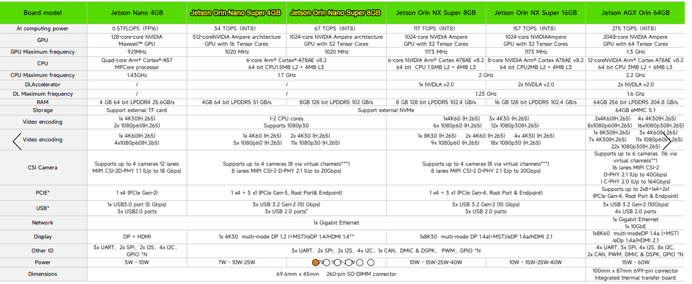

## My Project Hardware Stack
Below is an outline of the stack i'm using for the project. 
For learners, you don't need anything quite so elaaborate to get started, you just want to max out available VRAM & CPU RAM then use LMStudio or Triton for model caching across both.
You _can_ run GPT-oss:20b on CPU, but even on my i9/14th it took around 500-1000 seconds per loop. _Not_ fun for testing!

### Dev PC / Homelab -

- Storage:2TB and 4TB HDD.

  <u><strong>Ubuntu</strong></u> 2 x Samsung 990 PRO NVMe 2 TB, (PCIe 4.0, 7,450 MB/s read, 6,900 MB/s write)

  <u><strong>Windows:</strong></u>

    - 1 x Samsung 990 PRO NVMe 1 TB, (PCIe 4.0, 7,450 MB/s read, 6,900 MB/s write) - My Windows Boot
    - 1 x Samsung 990 PRO NVMe 2 TB, (PCIe 4.0, 7,450 MB/s read, 6,900 MB/s write)
- CPU: 'intel i9/14th Gen'.

- GPU: 'ASUS STRIX TUF 4090' (24GB VRAM)

- Network: Mellanox Connectx-4 + 25GBE Copper

- PSU: ASUS TUF GAMING 'Gold' 1000w

- DRAM: 128gb Kingston Fury Beast DDR5

- Motherboard: 'ASUS Z790 - Pro Wifi'

- Case: Corsair 4000D - Infinirail

## Mini-ITX:

- Operating System: Ubunto 24.04.3 - Noble:Lastest

- Storage: 1 x 2TB Samsung 990 Pro NVME

- CPU: AMD Ryzen 5 5800X

- GPU: 'ASUS Pro-Duo 4070 Super' (12GB VRAM)

- Network: Mellanox Connectx-4 + 25GBE Copper

- PSU: Coolermaster SFX 850 Gold (the newer one with 5.1)

- DRAM: 64gb Corsair Vengeance DDR4

- Motherboard: 'Gigabyte Pro-Aourus 550i (version 3)'

- Case: 'Fractal Terra' - Jade (Heavily Customised for 'Bottom->Top' Fans)

## Triton Inference Server

- Operating System: Ubunto 24.04.3 - Noble:Lastest

- Storage: 1 x 1TB Samsung 990 EVO Plus, 1TB, PCIe 4.0 x4 / 5.0 x2, NVMe2.0 (up to 7150 MB/s), NVMe M.2 (2280)

- CPU: 'Intel i9/10th Gen'

- GPU: 'ASUS STRIX 2080ti' (11GB VRAM)

- Network: Mellanox Connectx-4 + 25GBE Copper

- PSU: A brand new 'ASUS TUF Gaming Gold' 750w

- DRAM: 128gb Corsair Vengeance DDR4 (4 x 32GB)

- Motherboard: ASUS TUF 'X299'.

- Case: 'Fractal Design Meshify C' (on its way to me in the post)

## VLM Runner - For Camera Tagging of 4-8 Camera's

1 x NVIDEA Jetson Orin Nano Super 'Developer Kit' - 8GB
1 x Lexar Silver Plus 128GB Micro SD card - 205MB/s

<h2 align='center'>  
  The NVIDEA Jetson Orin AI / Robotics / Video Camera Family 
  </h2>  
    

  
    

## My Pi 5 (Home Assistant Controller)

1 x iRasptek Raspberry Pi 5 16GB Starter Kit

1 x Lexar Silver Plus 128GB Micro SD card - 205MB/s

Operating System: Ubuntu server

## Alexa 'Home Assistant' Frankenstein Build Peripherals

2 x Echo Dot (5th generation, 2022 release)

1 x Echo Dot (3rd Gen)

2 x Echo Flex | Plug-in mini smart speaker with Alexa

smart speaker with Alexa")

2 x THIRDREALITY USB Motion Sensor 2 Pack for Echo Flex, Setup